<div align="center">


# SabiEcho

**Global visitors. Local understanding.**

Visitor feedback, heard in the host’s own language. Offline, on an ordinary phone.

[**Try the live app**](https://sabiecho.vercel.app) · [**One-page product description (PDF)**](SabiEcho_Product_Description.pdf)

</div>

---

SabiEcho is an installable web app for community tourism hosts. A visitor’s review in **English or French**, typed, spoken or shared from WhatsApp, is turned into **27 numbered meanings** and played back in the host’s language as **phrases recorded by real people**. Everything runs on the phone, with no server and no signal needed after the first visit. The pilot language is **Fon (Benin)**.

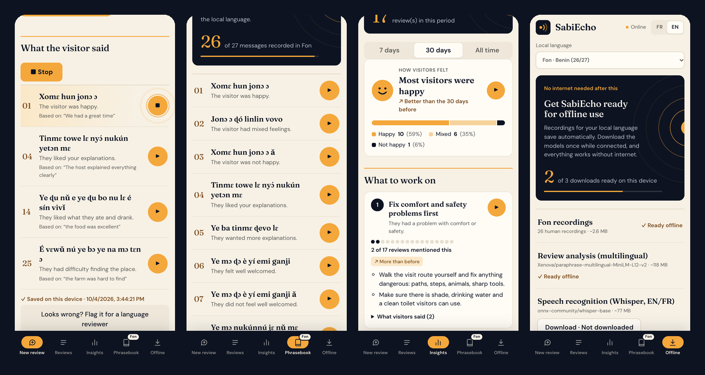

## Contents

- [The problem](#the-problem)
- [How it works](#how-it-works)
- [The 27 meanings](#the-27-meanings)
- [Architecture](#architecture)
- [The classifier and how it was trained](#the-classifier-and-how-it-was-trained)
- [Results](#results)
- [Language reviewers and on-device learning](#language-reviewers-and-on-device-learning)
- [Offline by design](#offline-by-design)
- [Sharing from WhatsApp](#sharing-from-whatsapp)
- [Privacy](#privacy)
- [Getting started](#getting-started)
- [Adding a language](#adding-a-language)
- [Project structure](#project-structure)
- [Limitations and roadmap](#limitations-and-roadmap)
- [Credits](#credits)

## The problem

Many hosts in community tourism do not read English or French well, so the feedback that could improve their visits goes unheard. Machine translation into languages like Fon is rare and unreliable, and connections at rural sites are patchy. SabiEcho does not try to translate. It works out **what the visitor meant** and plays that meaning in the host’s language, recorded by a person.

## How it works

1. **Capture.** The host types or pastes a review, records the visitor speaking, uploads a voice note, or shares a message or voice note straight from WhatsApp.
2. **Understand.** Speech is transcribed on the phone. The review is split into parts, and each part is matched to one of 27 numbered meanings.
3. **Hear.** Each meaning plays as a human recording in the host’s language. When the app is unsure, it says so and keeps the review for a person to read, rather than guessing.

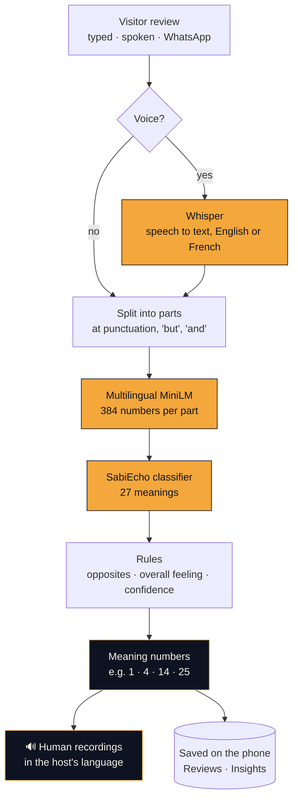

### A real example

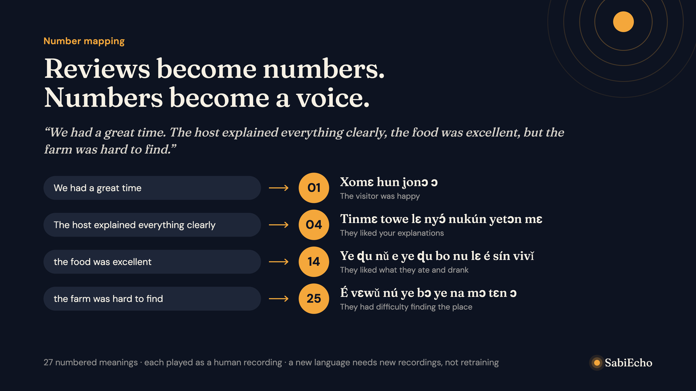

> *“We had a great time. The host explained everything clearly, the food was excellent, but the farm was hard to find.”*

| Part of the review | Number | Played in Fon | Meaning |
|---|---|---|---|
| We had a great time | **01** | Xomɛ hun jonɔ ɔ | The visitor was happy |
| The host explained everything clearly | **04** | Tinmɛ towe lɛ nyɔ́ nukún yetɔn mɛ | They liked your explanations |
| the food was excellent | **14** | Ye ɖu nǔ e ye ɖu bo nu lɛ é sín vivǐ | They liked what they ate and drank |
| the farm was hard to find | **25** | É vɛwǔ nú ye bɔ ye na mɔ tɛn ɔ | They had difficulty finding the place |

Each result also shows its **evidence**, the exact words the meaning came from, so a host or reviewer can see why.

## The 27 meanings

The classifier only ever outputs numbers. That is the key design decision: **the AI never has to produce Fon**. A number is language-independent, and each language simply supplies a recording for each number.

| # | Group | Meaning |
|---|---|---|
| 1 · 2 · 3 | Overall feeling | Happy · Mixed feelings · Not happy |

Eleven topics, each with a positive and a negative meaning:

| Topic | Positive | Negative |
|---|---|---|
| Explanations | **4** They liked your explanations | **5** They wanted more explanations |
| Welcome | **6** They felt well welcomed | **7** They did not feel well welcomed |
| Understanding | **8** They understood you well | **9** They had difficulty understanding you |
| Participation | **10** They enjoyed doing things with their own hands | **11** They wanted to participate more |
| Place | **12** They liked the place and the scenery | **13** The place did not impress them |
| Food | **14** They liked what they ate and drank | **15** They wanted more to eat or drink |
| Shopping | **16** They were happy to buy something to take away | **17** They wanted something available to buy |
| Comfort and safety | **18** They felt comfortable and safe | **19** They had a problem with comfort or safety |
| Organisation | **20** They liked how the visit was organized | **21** They had a problem with the timing or duration |
| Price | **22** They thought the price was fair | **23** They thought the price was too high |
| Access | **24** They found the place easily | **25** They had difficulty finding the place |

| # | Meaning |
|---|---|
| **26** | They said they would return or recommend it to others |
| **27** | Not sure. The review is kept for someone to read |

The full list, with French wording and example sentences, is in [`src/lib/taxonomy.ts`](src/lib/taxonomy.ts).

## Architecture

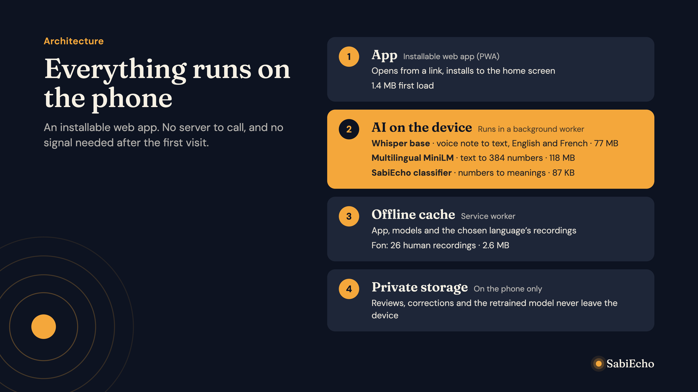

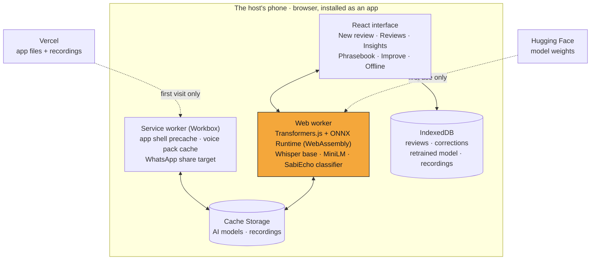

| Part | What it does | Size |
|---|---|---|
| App shell | React 19 + TypeScript, built with Vite, installable PWA | 1.4 MB first load |
| Speech to text | `onnx-community/whisper-base`, 8-bit, English and French, with automatic language detection | ~77 MB, downloaded when first needed |
| Sentence model | `Xenova/paraphrase-multilingual-MiniLM-L12-v2`, 8-bit, turns text into 384 numbers | ~118 MB, downloaded when first needed |
| Classifier | A softmax layer trained for SabiEcho, 27 classes × 384 inputs | 87 KB, ships with the app |
| Voice pack | Human recordings for the host’s chosen language only | Fon: 26 clips, ~2.6 MB |

The AI runs in a **web worker** so the interface stays responsive while models load and run.

## The classifier and how it was trained

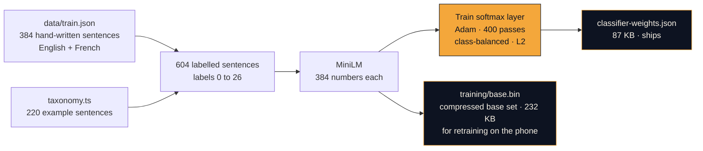

- **Labels.** Each sentence is labelled with its meaning number, 1 to 26. Label **0** means “not feedback about the visit” (for example *“My phone battery died”*), which teaches the model when to stay quiet. Meaning 27 is never trained. It is what the app shows when nothing is confident enough.
- **Model.** The large sentence model stays frozen. Only a small layer on top (10,395 parameters) is trained, using multinomial logistic regression. It trains in seconds, which is what makes retraining on a phone possible.
- **Rules on top.** Each part of a review contributes its most likely meanings above a 0.5 probability. Opposite pairs cannot both win (the stronger one is kept). Meanings 1 to 3 are only chosen when the visitor states an overall verdict, and *happy* plus *not happy* becomes *mixed*. If nothing passes, the answer is **27**.
- **Code.** Training: [`scripts/train-head.ts`](scripts/train-head.ts) and [`src/lib/train.ts`](src/lib/train.ts). Inference: [`src/lib/trained-classifier.ts`](src/lib/trained-classifier.ts).

## Results

Tested on **60 reviews written differently from the training data**: 26 in French, 12 with several meanings, and 3 that are not feedback. The test set is in [`data/test.json`](data/test.json) and the numbers come from [`scripts/benchmark.ts`](scripts/benchmark.ts).

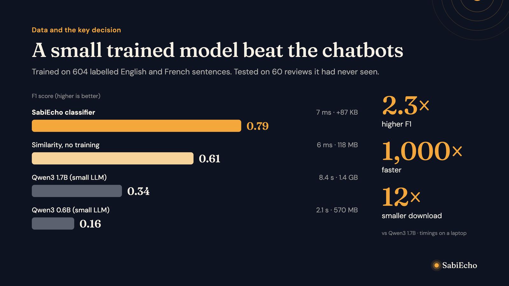

| Approach | F1 | Exact match | Overall feeling right | Time per review | Download |
|---|---|---|---|---|---|
| **SabiEcho classifier** | **0.79** | **39/60** | **50/60** | **~7 ms** | 118 MB shared + 87 KB |
| Similarity matching, no training | 0.61 | 28/60 | 49/60 | ~6 ms | 118 MB |
| Qwen3 1.7B (small LLM, 4-bit) | 0.34 | 5/60 | 34/60 | ~8.4 s | 1.4 GB |
| Qwen3 0.6B (small LLM) | 0.16 | 5/60 | 40/60 | ~2.1 s | 570 MB |
| Qwen2.5 1.5B Instruct (small LLM) | 0.05 | 3/60 | 36/60 | ~10.6 s | 1.2 GB |

Precision is 0.81 and recall 0.76. Timings were measured on a laptop. Retraining in the browser reproduces the same score (39/60), which confirms that on-device training matches the offline training script.

**Why not a chatbot model?** Small language models that fit on a phone were far less accurate on this task, hundreds to thousands of times slower, and 5 to 12 times bigger to download. A frozen sentence model with a small trained layer was the better fit for offline phones.

## Language reviewers and on-device learning

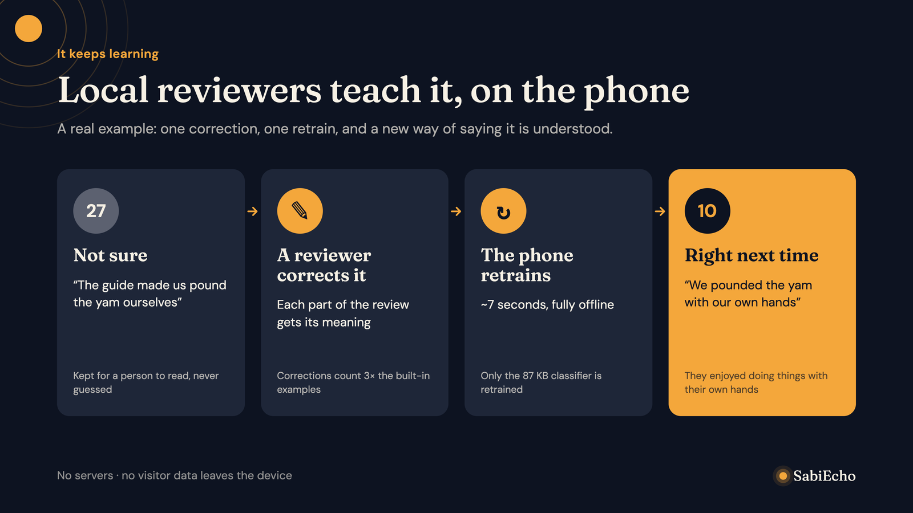

Trusted **language reviewers** sign in with a personal access code. Codes are signed with ECDSA P-256 by the project team and checked on the phone, so no server or account is needed. Each code lists the reviewer’s languages and roles:

| Role | What they can do |
|---|---|
| `correct` | Correct reviews the app got wrong, part by part, and teach it new phrases |
| `record` | Record the 27 phrases in their language |
| `vet` | Approve or reject other people’s recordings |

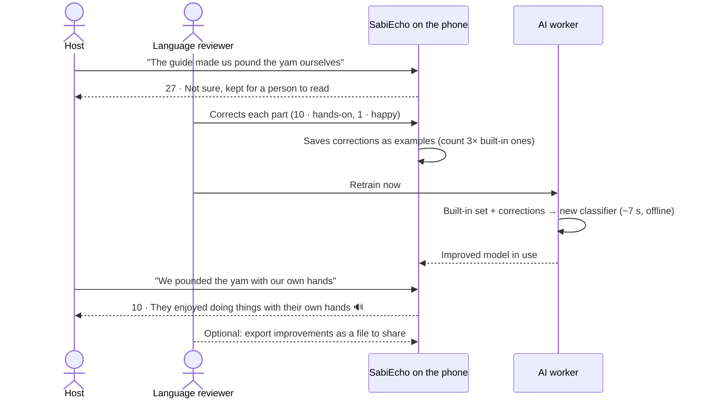

Improvements can be exported as a file and shared between phones, or sent to the project team. `npm run import-improvements` checks each contributor’s signed code before merging examples into the training data and approved recordings into the app.

## Offline by design

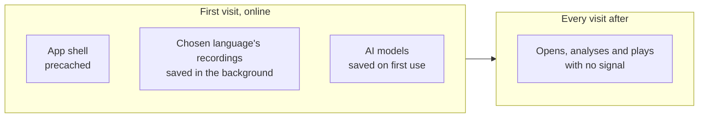

- The **service worker** precaches the app shell (1.4 MB).
- **Recordings are downloaded per language.** Only the host’s chosen language is saved, and it is retried automatically when the connection returns. The Offline tab shows progress.
- Saved recordings answer **byte-range requests**, which iPhone Safari uses for audio, so playback works offline on iOS too.
- The AI models are cached by Transformers.js on first use.

## Sharing from WhatsApp

On Android, an installed SabiEcho appears in the share menu. A host long-presses a visitor’s voice note or message in WhatsApp, taps **Share › SabiEcho**, and New review opens with it filled in.

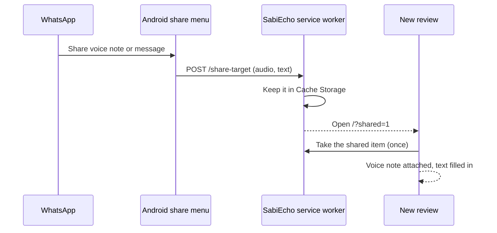

iPhone does not allow web apps in the share menu, so on iOS the app shows the steps instead: save the voice note to Files, then upload it.

## Privacy

- Reviews, corrections and the retrained model are stored **only on the phone** (IndexedDB).
- There is **no account, no backend and no analytics**. After the first visit, the app makes no network requests to work.
- The language reviewers’ signing key never ships. Only the public key is in the app ([`src/lib/volunteer-key.json`](src/lib/volunteer-key.json)), and the private key lives in an ignored `keys/` folder.

## Getting started

Requirements: **Node.js 20.19+ or 22.12+**.

```bash
git clone https://github.com/ChukaDean/sabiecho.git
cd sabiecho
npm install
npm run dev          # http://localhost:5173
```

The service worker is only active in a production build, so to test offline use, installation and WhatsApp sharing:

```bash
npm run build
npm run preview      # http://localhost:4173
```

The speech and analysis models (about 77 MB and 118 MB) download from Hugging Face the first time they are needed, then stay on the device.

### Scripts

| Command | What it does |
|---|---|
| `npm run dev` | Start the development server |
| `npm run build` / `npm run preview` | Production build and local preview with the service worker |
| `npm run train` | Retrain the shipped classifier from `data/train.json` and the taxonomy |
| `npm run benchmark -- <method>` | Score a method on the 60-review test set |
| `npm run eval` | Quick check of the similarity baseline, with `--verbose` or `--sweep` |
| `npm run try` | Classify sentences from the command line |
| `npm run issue-volunteer -- --name "Name" --languages fon --roles correct,record,vet` | Issue a signed language reviewer code (project team only) |
| `npm run import-improvements -- file.json` | Merge verified reviewer contributions |
| `npm run test:insights` / `npm run test:language` | Logic tests for Insights and language detection |

### Deployment

The repo is connected to Vercel, so every push to `main` deploys to [sabiecho.vercel.app](https://sabiecho.vercel.app). The `prebuild` step copies the ONNX Runtime WebAssembly files into `public/ort`.

## Adding a language

Because the classifier outputs numbers, **adding a language needs recordings, not retraining**. Fifteen languages are already in the picker, waiting for recordings: Fon (Benin), Akan (Ghana), Wolof (Senegal), Mandinka (The Gambia), Tashelhit (Morocco), Nobiin (Egypt), Amharic (Ethiopia), Maa (Kenya, Tanzania), Kinyarwanda (Rwanda), Rukiga (Uganda), Malagasy (Madagascar), isiXhosa (South Africa), Setswana (Botswana), Khoekhoe (Namibia) and Shona (Zimbabwe).

1. Issue codes to a recorder and a vetter for the language (`npm run issue-volunteer`).
2. They record and approve the 26 phrases (1 to 26) in the app’s **Improve › Voice recordings** tab, then export the file.
3. Run `npm run import-improvements -- <file>`. The clips go to `public/audio/<code>/` and their text to [`src/lib/recordings.json`](src/lib/recordings.json).
4. Deploy. Hosts who choose that language get its voice pack automatically.

To add a language that is not yet listed, add an entry to [`src/lib/languages.ts`](src/lib/languages.ts) first.

## Project structure

```text
├── SabiEcho_Product_Description.pdf   one-page product description
├── data/
│   ├── train.json                     384 labelled training sentences (EN/FR)
│   ├── test.json                      60 held-out test reviews
│   └── benchmark-results.json         scores behind the Results table
├── docs/                              README images and the product description source
├── public/
│   ├── audio/fon/                     human Fon recordings, one per meaning
│   ├── training/base.{bin,json}       compressed base training set for on-device retraining
│   └── share-target.js                WhatsApp share handler, loaded by the service worker
├── scripts/                           training, benchmarking, reviewer codes, imports
└── src/
    ├── App.tsx                        tabs and layout
    ├── worker.ts                      AI worker: Whisper, MiniLM, classifier, retraining
    ├── components/                    one component per screen
    └── lib/
        ├── taxonomy.ts                the 27 meanings
        ├── trained-classifier.ts      inference and rules
        ├── train.ts                   softmax training, used by the script and the phone
        ├── insights.ts, advice.ts     Insights and practical advice
        ├── voice-library.tsx          recordings per language
        ├── voice-pack.ts              offline download of a language's recordings
        ├── shared-inbox.ts            picks up items shared from WhatsApp
        └── credential.ts              signed language reviewer codes
```

## Limitations and roadmap

**Current limits**

- The training and test sentences were written by the team, not collected from real visitors. The pilot will provide real data, which on-device corrections are designed to absorb.
- The test set is small (60 reviews), so treat the scores as indicative.
- Speech input is English and French only.
- Fon has 26 of 27 phrases recorded. Three newer phrases (10, 20 and 27) still need native-speaker review, and 27 has no recording yet.

**Next**

- Pilot with hosts in Benin.
- Native-speaker review of the newer Fon phrases, and the last recording.
- Recruit language reviewers for the next languages.
- Fold real, reviewer-approved corrections back into the shipped classifier.

## Credits

- Speech recognition: [Whisper](https://github.com/openai/whisper) by OpenAI, ONNX build by [onnx-community](https://huggingface.co/onnx-community/whisper-base).
- Sentence model: [paraphrase-multilingual-MiniLM-L12-v2](https://huggingface.co/sentence-transformers/paraphrase-multilingual-MiniLM-L12-v2) by sentence-transformers, ONNX build by [Xenova](https://huggingface.co/Xenova/paraphrase-multilingual-MiniLM-L12-v2).
- In-browser AI: [Transformers.js](https://github.com/huggingface/transformers.js) and ONNX Runtime Web.
- Offline support: [Workbox](https://developer.chrome.com/docs/workbox) via vite-plugin-pwa.
- Fon wording cross-checked against a public French–Fon parallel corpus on Zenodo. Recordings by human speakers.
- Fonts: Fraunces and DM Sans.
